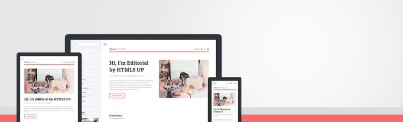

Качаем из git
```
git clone https://github.com/jumpgh/editorial-jekyll-theme.git
```
чтобы запустить локально
```
gem install bundler jekyll
bundle exec jekyll serve --watch
```

# Originaly Editorial - Jekyll Theme

A Jekyll version of the "Editorial" theme by [HTML5 UP](https://html5up.net/).

 

Adapted by https://gitlab.com/andrewbanchich/editorial-jekyll-theme


# Configuration

You can use the following custom parameters in `_config.yml`.

## Site
- `subtitle` sets the text for the lighter colored text next to your site's title.

## Social

- `500px`
- `facebook`
- `github`
- `gitlab`
- `googleplus`
- `instagram`
- `linkedin`
- `pinterest`
- `slack`
- `twitter`

## Collections

'_products' - карточки обуорудования

Формат карточки 
```
# структурированная часть
---
#  шаблон странички
layout: product 
# производитель
vendor: ПРОКСИА
# модель
model:  БР-8
# список категорий устройства
category:
- relays
# краткое описание устройства
brief: "Блок реле (БР-8) предназначен для ..."
# подробное описание устройства
description: "Блок реле (БР-8) предназначен для включения..."
# список изображений устройства (первая картинка отображается в списке устройств)
images: 
- "http://proxia.ru/images/stories/flexicontent/m_br-8_big.png"
---

# свободная часть карточки в формате HTML или Markdown с шаблонируемыми элементами в формате Liquid
```
'_solutions' - карточки решений
```
```


# Issues

If you would like to report a bug, ask a question, request a feature, feel free to do so on [the GitLab repository](https://gitlab.com/andrewbanchich/editorial-jekyll-theme) and I will be more than happy to help!

Alternatively, you can open an issue via email by emailing [incoming+andrewbanchich/editorial-jekyll-theme@incoming.gitlab.com](mailto:incoming+andrewbanchich/editorial-jekyll-theme@incoming.gitlab.com).

The GitHub repository is simply a mirror of the GitLab repository.

# Credits

Original README from HTML5 UP:

```
Editorial by HTML5 UP
html5up.net | @ajlkn
Free for personal and commercial use under the CCA 3.0 license (html5up.net/license)


Say hello to Editorial, a blog/magazine-ish template built around a toggleable "locking"
sidebar (scroll down to see what I mean) and an accordion-style menu. Not the usual landing
page/portfolio affair you'd expect to see at HTML5 UP, but I figured for my 41st (!!!)
template I'd change it up a little. Enjoy :)

Demo images* courtesy of Unsplash, a radtastic collection of CC0 (public domain) images
you can use for pretty much whatever.

(* = not included)

AJ
aj@lkn.io | @ajlkn


Credits:

	Demo Images:
		Unsplash (unsplash.com)

	Icons:
		Font Awesome (fortawesome.github.com/Font-Awesome)

	Other:
		jQuery (jquery.com)
		html5shiv.js (@afarkas @jdalton @jon_neal @rem)
		Misc. Sass functions (@HugoGiraudel)
		Respond.js (j.mp/respondjs)
		Skel (skel.io)
```

Repository [Jekyll logo](https://github.com/jekyll/brand) icon licensed under a [Creative Commons Attribution 4.0 International License](http://choosealicense.com/licenses/cc-by-4.0/).
